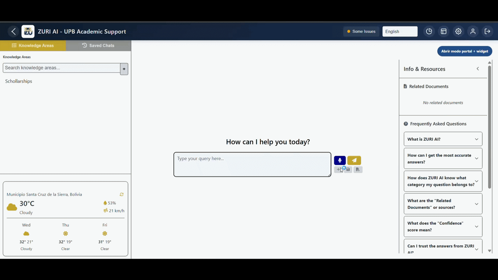
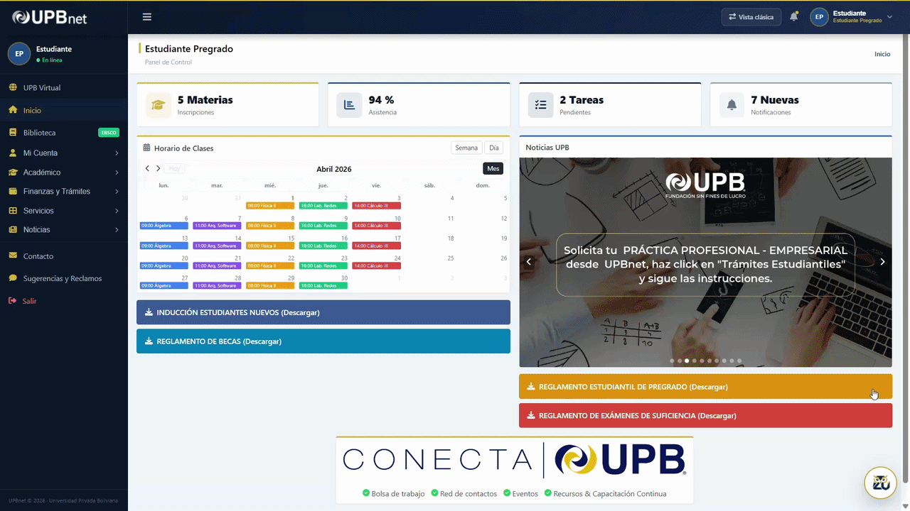
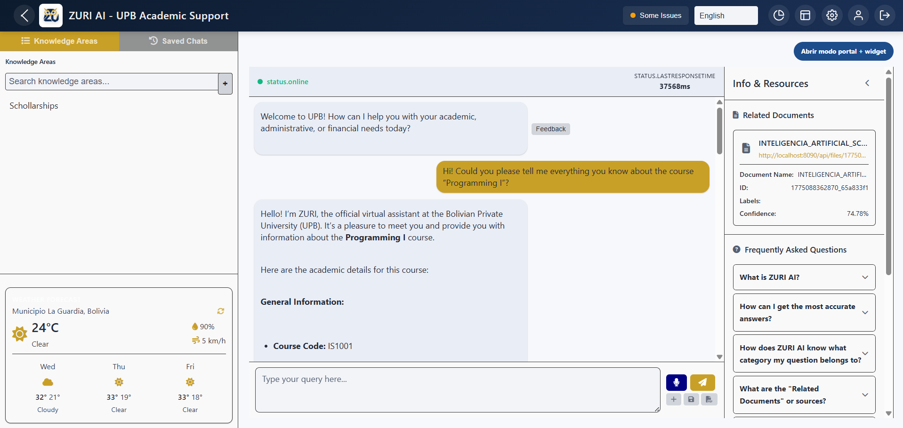
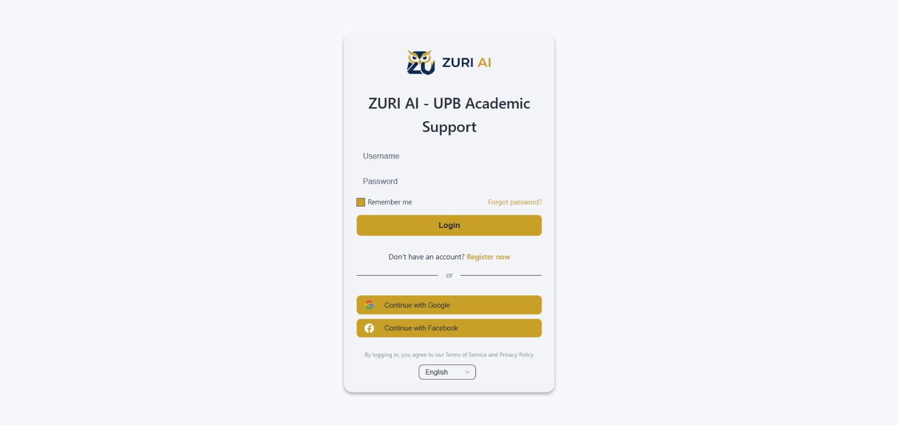
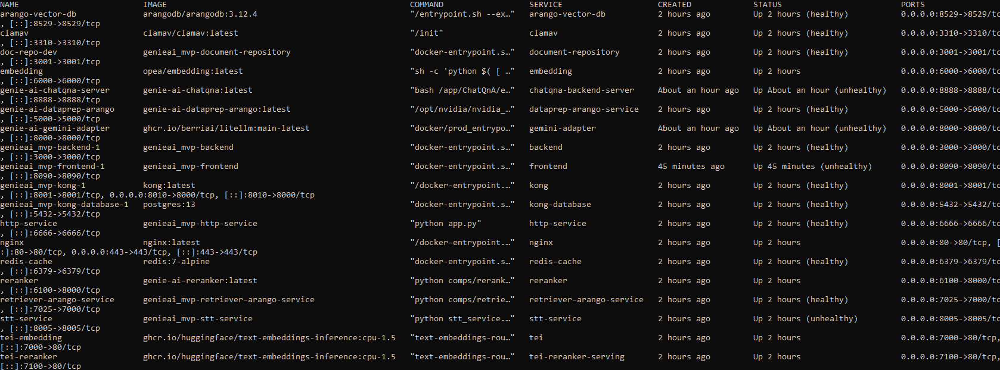

# ZURI AI — Intelligent Academic Assistant for UPB
 


 
**ZURI AI** is a RAG-based (Retrieval-Augmented Generation) conversational assistant for Universidad Privada Boliviana (UPB). Built on top of the open source framework [GENIE.AI](https://github.com/unicc-solution-center/genie.ai) by Intel/UNICC, this MVP applies deep refactoring across security, resiliency, AI pipeline, and multilingual support — transforming a generic government-oriented framework into a functional academic product.
 
One of the core achievements of this project is the **democratization of AI inference**: the original GENIE.AI framework required expensive NVIDIA GPU hardware to run its TEI services (Embeddings and Reranker). ZURI AI runs **100% on CPU-only x86 architectures**, with no specialized hardware required. This makes on-premise deployment radically more accessible and affordable for academic institutions, without sacrificing the precision of heavyweight models like `BAAI/bge-m3`.
 
---
 
## Table of Contents
 
- [Key Features & Improvements](#-key-features--improvements)
- [Architecture](#general-architecture)
- [Services](#stack-services)
- [Quickstart](#-quickstart)
- [Environment Variables](#environment-variables)
- [Roadmap](#-roadmap--next-steps)
- [Extended Documentation](#-extended-documentation)
- [License](#license)
 
---
 
## 🌟 Key Features & Improvements
 
### Security
 
| Improvement | Impact |
|-------------|--------|
| **Mandatory JWT Secret** | The backend executes `process.exit(1)` if `JWT_SECRET` is undefined or uses an insecure default value. Fail-fast by design. |
| **Restricted JWT Algorithm** | All `jwt.verify()` calls enforce `algorithms: ['HS256']`, blocking `alg:none` attacks and HS256/RS256 confusion. |
| **Layered Rate Limiting** | Global (200 req/min), auth (10 req/15min), registration (5 req/hour). Registered *before* the body parser to prevent DoS via large payloads. |
| **Path Traversal Blocked** | Filename validation with `os.path.basename()` + character whitelist + extension whitelist in Dataprep. |
| **Internal HMAC Authentication** | All internal microservices validate `X-Internal-API-Key` using `hmac.compare_digest()` (timing-attack safe). |
| **Anchored CORS Regex** | CORS patterns are built with automatic `^...$` anchors; requests without `Origin` are blocked in production. |
| **Magic-Byte File Validation** | Real file type verification (PDF, JPEG, PNG, DOCX) via leading bytes — not just declared MIME type. |
| **Joi Input Validation** | Strict schemas on `/register`, `/login`, and `/refresh-token`. |
 
### Resiliency & Stability
 
| Improvement | Impact |
|-------------|--------|
| **Global Pipeline Timeout (90 s)** | `asyncio.wait_for()` wraps the full pipeline (embedding → retrieval → reranking → LLM). Timeout returns a localized HTTP 504 instead of hanging indefinitely. |
| **Worker Thread Pool (Piscina)** | Persistent worker pool for OPEA queries (`maxThreads: 4`). Eliminates OOM from uncontrolled thread-spawning. |
| **Docker Resource Limits** | All services have `deploy.resources.limits` defined (memory and CPUs). |
| **Complete Health Checks** | All services have `healthcheck` configured with appropriate `start_period` for heavy model loading. |
| **Frontend Timeout (95 s)** | `ECONNABORTED` detection with localized error messages in 11 languages. |
 
### AI Pipeline
 
| Improvement | Impact |
|-------------|--------|
| **Gemini as LLM via LiteLLM** | `gemini-adapter-wrapper` microservice translates OpenAI format → Gemini API. Fully configurable via env vars. |
| **Intent Classifier** | DistilBERT zero-shot (`typeform/distilbert-base-uncased-mnli`) classifies queries as `ACADEMIC`, `ADMINISTRATIVE`, or `GENERAL` with a 2 s timeout and automatic fallback. |
| **Chunk Ingestion Fallback** | If `LLMGraphTransformer` fails (Gemini overloaded), chunks are inserted directly with local TEI embeddings. Data is never silently lost. |
| **Robust LLM Error Handling** | Response structure validated before accessing `choices`. Gemini 503 errors produce clear messages, not `KeyError`. |
| **LiteLLM Retries Disabled** | `LITELLM_NUM_RETRIES=0` prevents API key exhaustion from aggressive retries (1 error = 1 request, not 5). |
| **Reranking Pipeline Fixed** | Endpoint, request fields, and response parsing aligned with the actual service contract. |
| **Speech-to-Text (STT)** | Whisper service integrated for voice input. |
 
### Multilingual Support
 
| Improvement | Impact |
|-------------|--------|
| **`bge-m3` Embedding Model** | Supports 100+ languages (vs. `bge-base-en-v1.5` which is English-only). 1024-dimension vectors. |
| **Multilingual OCR** | EasyOCR configurable via `DATAPREP_OCR_LANGS` env var (default: `en,es`). |
| **Multi-language Document Validation** | `DOCUMENT_INGESTION_LANGUAGE` accepts a comma-separated list. |
| **Error Messages in 11 Languages** | en, es, fr, de, ar, pt, ru, zh, sw, th, id. |
 
### UI/UX Modernization
 
The original GENIE.AI framework shipped with a rigid, button-driven interface — 9 hardcoded shortcut buttons that forced users into predefined interaction patterns, with no conversational flexibility.
 
ZURI AI replaces this entirely with a **modern, clean conversational interface** inspired by leading AI assistants (ChatGPT / Gemini):
 
- **Conversational-first design**: A centered input field ("How can I help you?") replaces all legacy shortcuts, with integrated controls for text submission and voice note recording (Speech-to-Text via Whisper). The interaction model is open-ended and natural.
- **Full institutional re-branding**: Complete visual identity overhaul aligned with UPB's brand guidelines — custom color palette (`#C9A027` gold / `#0d1b2e` navy), institutional logos, splash screen, and dark mode adapted to the university's design system.
- **Multi-view architecture**: Two distinct frontend interaction modes were developed:
  - **Fullscreen Chat** — the classic dedicated chat interface at full viewport, ideal for direct access.
  - **Floating Pop-up Widget** — an injectable `FloatingChatWidget.vue` component embedded into a simulated static university landing page (`StudentPortalShellView.vue`), demonstrating true plug-and-play integration capability for existing institutional portals with zero modifications to the host page.
 
This dual-mode approach proves that ZURI AI can be deployed either as a standalone product or silently embedded in any university portal infrastructure.

### 📸 Visual Showcase

**1. Fullscreen Conversational Interface & Voice Interaction**
<div align="center">
  
</div>
<br>

**2. Institutional Portal Integration (Pop-up Widget)**
<div align="center">
  
</div>
<br>

**3. Advanced RAG Capabilities (Knowledge Extraction & Citation)**
<div align="center">
  
</div>
<br>

**4. Secure Authentication Portal**
<div align="center">
  
</div>
<br>

**5. Backend Infrastructure (CPU-Only Docker Stack)**
<div align="center">
  
</div>
<br>

### Code Quality
 
- **Debug logging eliminated in production** via `terser-webpack-plugin` with `pure_funcs: ['console.log']`.
- **Centralized `AuthTokenManager`** — reusable class with double-checked locking; ~70 lines of duplicated code removed.
- **ArangoDB edge collections corrected** — `userConversations`, `userFolders`, `folderConversations` recreated as `type=3` (edge) instead of `type=2` (document). Fix persisted in `arango-init.js`.
- **GPU dependency eliminated** — all inference images migrated to CPU-only, making the entire stack run on commodity hardware. The original framework required `runtime: nvidia` and physical GPU devices just to start. ZURI AI needs neither.
 
---
 
## General Architecture
 
```
                         ┌──────────────┐
                         │     User     │
                         └──────┬───────┘
                                │
                    ┌───────────▼────────────┐
                    │     NGINX (TLS/80/443) │
                    └───────────┬────────────┘
                                │
                    ┌───────────▼────────────┐
                    │  Kong API Gateway      │
                    │  (rate limit, auth)     │
                    └──┬─────────┬───────┬───┘
                       │         │       │
            ┌──────────▼──┐  ┌──▼────┐  ┌▼──────────────────┐
            │  Frontend   │  │Backend│  │Document Repository │
            │  Vue.js 3   │  │Node.js│  │  (uploads, ingest) │
            │  :8090      │  │:3000  │  │  :3001             │
            └─────────────┘  └──┬────┘  └────────┬───────────┘
                                │                │
                    ┌───────────▼────────────┐   │
                    │  ChatQnA Pipeline      │   │
                    │  (OPEA Mega-service)   │   │
                    │  :8888                 │   │
                    └──┬──────┬──────┬───────┘   │
                       │      │      │           │
              ┌────────▼┐ ┌──▼───┐ ┌▼────────┐  │
              │Embedding│ │Rerank│ │  Gemini  │  │
              │TEI :7000│ │:7100 │ │  Adapter │  │
              │(bge-m3) │ │      │ │  :8000   │  │
              └─────────┘ └──────┘ └────┬─────┘  │
                                        │        │
                                   ┌────▼────┐   │
                                   │ Google  │   │
                                   │ Gemini  │   │
                                   │  API    │   │
                                   └─────────┘   │
                    ┌────────────────────┐       │
                    │   ArangoDB 3.12    │◄──────┘
                    │  (doc + graph +    │
                    │   vector index)    │
                    └────────────────────┘
                    ┌────────────────────┐
                    │   Redis 7          │
                    │  (translation      │
                    │   cache)           │
                    └────────────────────┘
```
 
### RAG Query Flow
 
1. The user sends a message from the frontend (text or voice via STT).
2. The **intent classifier** (DistilBERT) evaluates the query:
   - `ADMINISTRATIVE` → predefined response (bypasses the RAG pipeline).
   - `ACADEMIC` / `GENERAL` → continues through the full pipeline.
3. The query is converted into an **embedding** (TEI with bge-m3).
4. The **retriever** searches for relevant chunks in ArangoDB (vector + graph + metadata).
5. The **reranker** (TEI with bge-reranker-base) reorders results by relevance.
6. The selected chunks + query are sent to **Google Gemini** via the LiteLLM adapter.
7. The response is returned to the user with intent metadata and sources.
 
---
 
## Stack Services
 
| Service | Image / Build | Port | Function |
|---------|--------------|------|----------|
| `arango-vector-db` | `arangodb:3.12.4` | 8529 | Multimodel database (doc + graph + vector) |
| `redis-cache` | `redis:7-alpine` | 6379 | Translation cache |
| `kong` | `kong:latest` | 8001, 8010 | API Gateway |
| `nginx` | `nginx:latest` | 80, 443 | Reverse proxy / TLS |
| `tei` | `text-embeddings-inference:cpu-1.5` | 7000 | Embedding model (bge-m3) |
| `tei-reranker-serving` | `text-embeddings-inference:cpu-1.5` | 7100 | Reranking model (bge-reranker-base) |
| `embedding` | `opea/embedding:latest` | 6000 | OPEA embedding microservice |
| `reranker` | Local build | 6100 | OPEA reranking microservice (custom) |
| `backend` | Local build | 3000 | Node.js + Express API |
| `frontend` | Local build | 8090 | Vue.js 3 UI |
| `document-repository` | Local build | 3001 | Document management & ingestion |
| `dataprep-arango-service` | Local build | 5000 | Data preparation for ArangoDB |
| `retriever-arango-service` | Local build | 7025 | Hybrid ArangoDB retriever |
| `chatqna-backend-server` | Local build | 8888 | ChatQnA Mega-service (OPEA) |
| `gemini-adapter` | `litellm:main-latest` | 8000 | OpenAI-compat proxy → Gemini |
| `http-service` | Local build | 6666 | JWT authentication service |
| `stt-service` | Local build | 8005 | Speech-to-Text (Whisper) |
| `clamav` | `clamav:latest` | 3310 | Antivirus scanning |
 
---
 
## 🚀 Quickstart
 
### Prerequisites
 
- **Docker** ≥ 24.0 and **Docker Compose** v2
- **RAM:** 16 GB minimum (32 GB recommended with all services active)
- **Disk:** ~15 GB for models (bge-m3, bge-reranker-base, DistilBERT) + Docker images
- **GPU:** not required — all inference images are CPU-only
- **Google Gemini API Key** (free tier sufficient for testing)
 
### 1. Clone and configure environment variables
 
```bash
git clone <repository-url>
cd zuri-ai-showcase
cp .env.example .env
```
 
Edit `.env` and configure at minimum:
 
```dotenv
# REQUIRED — the backend will not start without these
JWT_SECRET=<generate with: node -e "console.log(require('crypto').randomBytes(64).toString('base64'))">
SESSION_SECRET=<generate same as JWT_SECRET>
INTERNAL_API_KEY=<generate same as JWT_SECRET>
ARANGO_PASSWORD=<secure password>
 
# Google Gemini API Key
GEMINI_API_KEY=<your-api-key>
```
 
> See `.env.example` for the full variable list with inline documentation.
 
### 2. Download embedding models
 
```bash
# bge-m3 (multilingual embeddings)
mkdir -p models/bge-m3
# Download from HuggingFace: https://huggingface.co/BAAI/bge-m3
 
# bge-reranker-base
mkdir -p models/bge-reranker-base
# Download from HuggingFace: https://huggingface.co/BAAI/bge-reranker-base
```
 
### 3. Start the stack
 
```bash
# Start infrastructure first
docker compose up -d arango-vector-db redis-cache kong-database
 
# Wait ~10 seconds, then bring up the rest
docker compose up -d
```
 
### 4. Verify service health
 
```bash
# General status
docker compose ps
 
# Logs for a specific service
docker compose logs -f chatqna-backend-server
 
# Verify ArangoDB has the correct collections
docker exec arango-vector-db arangosh \
  --server.username root \
  --server.password "$ARANGO_PASSWORD" \
  --javascript.execute-string "db._collections().map(c => c.name())"
```
 
### 5. Ingest documents
 
Upload documents (PDF, DOCX, TXT, MD) via the `document-repository` service on port 3001, or directly from the admin panel in the frontend at `http://localhost:8090`.
 
### 6. Access the chat
 
Open `http://localhost:8090` in your browser.
 
---
 
## Environment Variables
 
All variables are fully documented in `.env.example` (~280 lines). Key sections:
 
| Section | Key Variables |
|---------|--------------|
| **Security** | `JWT_SECRET`, `SESSION_SECRET`, `INTERNAL_API_KEY` |
| **ArangoDB** | `ARANGO_URL`, `ARANGO_PORT`, `ARANGO_PASSWORD`, `ARANGO_DB_NAME` |
| **ChatQnA Pipeline** | `GEMINI_API_KEY`, `GEMINI_MODEL`, `LLM_MODEL`, `TOKENIZER_MODEL_ID` |
| **Classifier** | `LABELER_ENABLED`, `LABELER_MODEL_ID`, `LABELER_TIMEOUT_MS` |
| **Embeddings** | `EMBEDDING_MODEL_ID` (default: `BAAI/bge-m3`) |
| **STT** | `WHISPER_MODEL_SIZE`, `WHISPER_DEVICE`, `WHISPER_LANGUAGE` |
| **Frontend** | `FRONTEND_PORT`, `VUE_APP_API_URL`, `CORS_ALLOWED_ORIGINS` |
 
---
 
## 📍 Roadmap & Next Steps
 
### Short-term — Vue 3 Migration
 
The frontend `package.json` already uses Vue 3 (`^3.2.0`), but component source code retains Vue 2 syntax. This causes documented silent failures:
 
| Priority | Issue | Files |
|----------|-------|-------|
| 🔴 Critical | `$once("hook:beforeDestroy")` removed — memory leak | `AnalyticsDashboard.vue` |
| 🔴 Critical | Vue 2 render functions missing `import { h }` | `NotificationSystem.vue` |
| 🔴 Critical | `.fade-enter` → `.fade-enter-from` (CSS transitions) | `App.vue` |
| 🟠 High | `beforeDestroy` → `beforeUnmount` (6 components) | `ChatFolders.vue`, `ModalComponent.vue`, etc. |
| 🟠 High | `this.$root.$i18n` → `this.$i18n` | `ChatBotComponent.vue`, `SettingsComponent.vue` |
 
> Full migration plan in [`MIGRATION-VUE3-PLAN.md`](MIGRATION-VUE3-PLAN.md).
 
### Mid-term
 
- [ ] **Docker image pinning** — Lock all image versions with SHA256 digests.
- [ ] **Migrate Vuex → Pinia** — Official recommended state manager for Vue 3.
- [ ] **Update axios** `^0.27.2` → `^1.x` (breaking changes in error handling).
- [ ] **Remove global event bus** — Move coordination events to the store; move notifications to a Vue 3 plugin.
- [ ] **Automated test suite** — Install `@vue/test-utils@^2.x` for the frontend. Expand coverage in backend and pipeline.
- [ ] **RAG Evaluation with RAGAS** — Base infrastructure built; CI integration pending.
 
### Long-term
 
- [ ] **Composition API + `<script setup>`** — Rewrite complex components (`ChatBotComponent`, `AdminDashboard`, `UserProfileComponent`).
- [ ] **Conditional GPU support** — Docker Compose profiles for CPU-only and GPU (NVIDIA).
- [ ] **Kubernetes** — Migrate from Docker Compose to Helm charts for scalable deployment.
- [ ] **Intent classifier fine-tuning** — Train with real UPB query data instead of zero-shot.
 
---
 
## 📚 Extended Documentation
 
| Document | Contents |
|----------|----------|
| [`ARCHITECTURE-CHANGES-REPORT.md`](ARCHITECTURE-CHANGES-REPORT.md) | Detailed report of all architecture decisions, with code diffs and technical rationale. |
| [`CHANGELOG_PHASE_1_TO_3.md`](CHANGELOG_PHASE_1_TO_3.md) | Full changelog across the 3 hardening phases (security, resiliency, quality). |
| [`MEJORAS-IMPLEMENTADAS.md`](MEJORAS-IMPLEMENTADAS.md) | Security fixes, partial Vue 3 migration, and multilingual support. |
| [`FIXES-APPLIED.md`](FIXES-APPLIED.md) | Diagnosis and resolution of critical bugs (empty chunks, Gemini KeyError). |
| [`MIGRATION-VUE3-PLAN.md`](MIGRATION-VUE3-PLAN.md) | Sprint-by-sprint plan to complete the Vue 2 → Vue 3 migration. |
| [`RESUMEN-FRAMEWORK-ORIGINAL.md`](RESUMEN-FRAMEWORK-ORIGINAL.md) | Analysis of the original GENIE.AI framework (architecture, stack, capabilities). |
| [`.env.example`](.env.example) | Complete environment variable reference with inline documentation. |
 
---
 
## Repository Structure
 
```
├── components/
│   ├── gov-chat-backend/       # Node.js + Express API
│   ├── gov-chat-frontend/      # Vue.js 3 UI
│   ├── document-repository/    # Document management & ingestion
│   ├── arangodb/               # ArangoDB scripts and configuration
│   └── shared/                 # Shared libraries (logging, security)
├── genie-ai-overlay/
│   ├── chatqna/                # ChatQnA Mega-service + intent classifier
│   ├── dataprep/               # Data preparation for ArangoDB
│   ├── retriever/              # Hybrid retriever (vector + graph)
│   ├── reranker/               # Custom reranker
│   ├── gemini-adapter-wrapper/ # OpenAI → Gemini proxy (LiteLLM)
│   ├── http-service/           # JWT authentication service
│   └── core/                   # Shared modules (AuthTokenManager)
├── api-gateway-solution/       # Kong + NGINX configuration
├── mobile/genie_ai_mobile/     # Flutter mobile client (Android/iOS/Web)
├── models/                     # Downloaded models (bge-m3, bge-reranker-base)
├── data/                       # ArangoDB data and country-specific datasets
├── configs/                    # OPEA configuration
├── docker-compose.yaml         # Main stack (CPU-only)
├── docker-compose-t4.yaml      # NVIDIA T4 GPU variant
├── docker-compose-RTX6000-ADA.yaml  # RTX 6000 Ada GPU variant
└── .env.example                # Environment variable template
```
 
---

## Credits
 
- **Base framework:** [GENIE.AI](https://github.com/unicc-solution-center/genie.ai) — Intel / UNICC / ITU
- **RAG pipeline:** [OPEA (Open Platform for Enterprise AI)](https://opea.dev) — Intel
- **ZURI AI adaptation:** Uziel Fassi — Universidad Privada Boliviana (UPB)
 
---

## 👨‍💻 Authors & Contact

**Uziel Fassi** *Computer Science Undergraduate & Full-Stack / AI Engineer* [](https://www.linkedin.com/in/uziel-fassi-08840a287/) 
[](https://myportfoliouzielf.framer.website)
[](https://github.com/Uziel-Fassi)

**Peter Terán** *Computer Science Undergraduate & Full-Stack / AI Engineer* [](https://github.com/peterteranb)

---

Are you interested in deploying a custom AI solution for your institution, or looking to discuss software architecture? Let's connect!
 
## License
 
**Distribution Notice:** The base framework (GENIE.AI / OPEA) operates under the Open Source Apache 2.0 license. However, all security refactoring, performance optimization, branding, and ZURI AI-specific code are **Proprietary / Closed Source** for commercial and institutional use. This repository functions exclusively as a **technical and architectural documentation showcase**. The source code is not publicly available.
